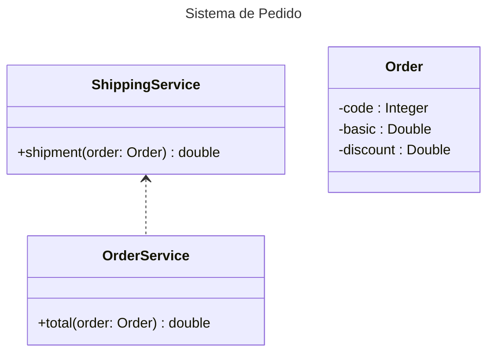

<div>
<h1>DESAFIO: Sistema de Pedidos</h1> 
<p>Sistema simples desenvolvido para calcular o valor total de pedidos.</p>
  
[Formação Java Spring Ultimate](https://paragonst.s3.sa-east-1.amazonaws.com/java-spring-ultimate-brochura-2023-07.pdf)

[](https://docs.oracle.com/en/java/javase/17)
[](https://docs.spring.io/spring-boot/docs/current/reference/htmlsingle)
[](https://maven.apache.org/guides)
</div>

## Framework e Bibliotecas
- **Java 17**: Develop
- **Spring Boot**: Framework;
- **Maven**: Para solução gerenciamento de dependencias.

## Alguns dos assuntos abordados:
- Criação de projeto Spring Boot
- Configuração de componentes Spring e injeção de dependência
- Implementação de projeto de componentes

## Passo a passo

### **Criação de projeto Spring Boot**
  
[](https://start.spring.io/)


[Spring Initializr Reference Guide](https://docs.spring.io/initializr/docs/0.4.x/reference/htmlsingle/)
- **Project:** Selecionar o Maven - é uma ferramenta de gerenciamento e compreensão de projetos de software.
- **Language:** Selecionar a Linguagem de programação - No caso desse projeto foi o Java.
- **Spring Boot:** Selecionar a versão do Framework - Optar sempre pela última versão em que não tenha observações. Ex: (SNAPSHOT, M1, M2, etc.)
  
#### PROJECT METADATA

- **Group:** Informar um "Dominio ao contrario", utilizei o nome da plataforma do curso.(Pode colocar o seu dominio proprio ou ficticio)
- **Artifact:** O artefato a ser gerado (o nome da aplicação que será criada).
- **Name:** O nome será gerado igual ao Artifact.
- **Description:** Uma breve e objetiva descrição do projeto.
- **Package name:** Pacote raiz do projeto, gerado automaticamente conforme preenche os campos acima.
- **Packaging:** Empacotamento do projeto
- **Java:** Versões do java.(Recomendável sempre escolher a última versão LTS)

#### DEPENDENCIES

- **ADD DEPENDENCIES:** Adicionar a dependência Spring Web.
---

### **Configuração de componentes Spring e injeção de dependência**

- Após a criação do projeto, foi adicionado um plug-in do Maven para evitar erro no pom.xml.
  Aberto o arquivo pom.xml foi adicionado o trecho de código abaixo na sessão build > plugins
```xml
<plugin>
    <groupId>org.apache.maven.plugins</groupId>
    <artifactId>maven-resources-plugin</artifactId>
    <version>3.1.0</version> <!--$NO-MVN-MAN-VER$ -->
</plugin>

```

### Estrutura do projeto


#### **Configuração de componentes**

- Realizado a implementação das classes no projeto, foi realizado o registro dos componentes.
  
    @Service - Utilizado nas classes __OrderService__ e __ShippingService__, é usado com classes que fornecem algumas funcionalidades de negócios.
   
    @Autowired - Utilizado para injetar automaticamente dependências em classes gerenciadas pelo spring. Permitindo um código mais limpo e modular.

#### **Injeção de dependência e inversão de controle**

- Analisando a estrutura do projeto, nota-se que a class OrderService depende da ShippingService, contudo OrderService não pode ter controle sobre ShippingService,
visto que, se for necessário realizar modificação e/ou substituição, será necessário realizar em ambas. Portanto, se faz necessário a inversão de controle, através da
injeção de dependência, podendo ser feita via construtor ou via configurações/anotações do framework(@Autowired).

**CONSTRUTOR**
```java
public class OrderService {
    
    private ShippingService shippingService;

    public OrderService(ShippingService shippingService){
      this.shippingService = shippingService;
    }
...
}
```

**FRAMEWORK**
```java
public class OrderService {
    @Autowired
    private ShippingService shippingService;
...
}
```
  
  
